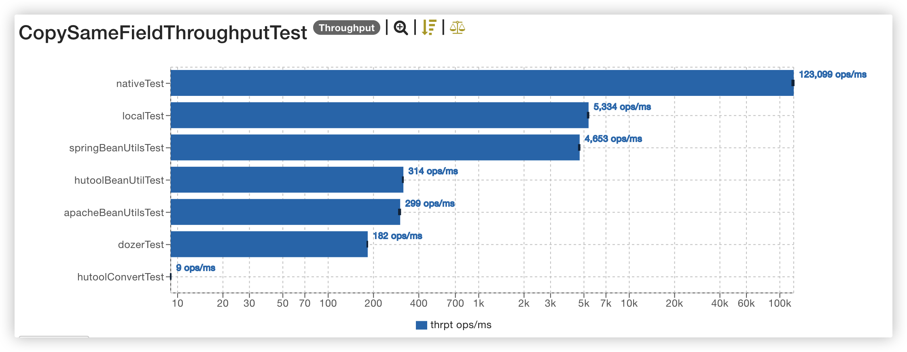

# **Tara**

[](https://travis-ci.org/sondertara/tara)


中文 | [English](README_en.md)

Tara是一个纯java工具包，包括常用util工具类和excel处理两个模块。

> **System Requirements:** Language: Java 8+

## 💎**common-tara**

通用工具包,包括常用的工具类,比如Bean 拷贝、时间处理、集合处理、IO操作、反射处理等常用工具

### 🍵**Import to project**

- Maven Project

```xml

<dependency>
    <groupId>com.sondertara</groupId>
    <artifactId>common-tara</artifactId>
    <version>1.0.2</version>
</dependency>
```

- Gradle project

```groovy
implementation 'com.sondertara:common-tara:1.0.2
```

### :eight_spoked_asterisk:**Features Induction**

- [X] 轻量且高性能Bean Copier
- [x] 常用集合处理工具，反射和时间处理工具等
- [x] ID生成器
- [X] 加密工具包
- [X] 正则表达式工具

#### :triangular_flag_on_post:***BeanUtils***

`BeanUtils` 是一个轻量级且高性能的JavaBean复制框架，支持拷贝不同类型和嵌套属性的自动拷贝

##### 1.属性类型一致对象拷贝

属性类型对象间拷贝,性能和`Spring BeanUtils`相当(稍微快一点点~),循环多次拷贝，同其他框架对比的基准测试如下:


吞吐量测试结果:



##### 2.属性类型不同嵌套对象拷贝

属性类型不一致时,有些框架不支持该特性，但是`Tara BeanUtils`完全支持，并且有较好的性能表现。 基准测试如下:


**Apache BeanUtils**: 运行异常

**Spring BeanUtils**: 属性类型不同时值会丢失,当访问嵌套属性时,抛出`ClassCaseException`

**Hutool**: 性能较弱

**Dozer**: 性能稍好

**Tara BeanUtils**: 和原生操作同一个量级

所有基准测试源码存放于 [JMH Test](example/src/main/java/benchmark)，测试结果存放于 [JMH Result](example/result)

## 💎**excel-tara**

灵活且高性能Excel处理框架,支多种方式导入和导出Excel

### 🍵Import to project

- Maven Project

```xml

<dependency>
    <groupId>com.sondertara</groupId>
    <artifactId>excel-tara</artifactId>
    <version>1.0.2</version>
</dependency>
```

- Gradle project

```groovy

```

### :eight_spoked_asterisk:**Features Induction**

- [X] 导出支持注解导出、简易导出和读取模板导出
- [x] 导出支持自动分Sheet,列宽自适应
- [x] 注解导出支持自定义样式,间隙条纹,自定义宽高
- [X] 导入支持注解导入和直接读取Excel中的数据
- [X] 注解导入支持值转换和数据校验
- [X] 直接导入支持流式读取

所有使用样例存放于[Excel-Test example](example/src/main/java/com/sondertara/excel)

#### :triangular_flag_on_post:**Excel Writer**

`Tara Excel` 支持注解导出、快捷导出和模板导出三种方式

##### **1.注解导出(ExcelBeanWriter)**

注解导出支持直接传入导出对象List和实现导出对象分页查询接口两个方式

- `@ExcelExport`: 对应Excel中的Sheet,支持导出多个不同数据的Sheet

```java
@Target(ElementType.TYPE)
@Retention(RetentionPolicy.RUNTIME)
public @interface ExcelExport {

    /**
     * the multiple sheet order, smaller is parsed earlier
     * 顺序（值越小，越靠前）
     *
     * @return order
     */
    int order() default 0;

    /**
     * The sheet name
     * Sheet名称
     *
     * @return sheet name
     */
    String sheetName() default "数据";

    /**
     * the max row of one sheet,excluding the title row
     * 每个Sheet页允许的最大条数（用于分页）
     *
     * @return the max row of one sheet
     */
    int maxRowsPerSheet() default 60000;

    /**
     * is open the row strip
     * 是否开启条纹
     *
     * @return is open the row strip
     */
    boolean rowStriped() default true;

    /**
     * the row strip color
     * 条纹颜色
     *
     * @return the color
     */
    String rowStripeColor() default "E2EFDA";

    /**
     * the title row height
     * 标题行高度
     *
     * @return the title row height
     */
    int titleRowHeight() default 20;

    /**
     * the data row height
     * 数据行高度
     *
     * @return the data row height
     */
    int dataRowHeight() default 20;

    /**
     * the bind type
     * If {@link ExcelColBindType#COL_INDEX} the value {@link ExcelExportField#colIndex()} must be set.
     * If {@link ExcelColBindType#ORDER} the colIndex is the order field definition order.
     *
     * @return whether enable colIndex
     * @see ExcelColBindType
     */
    ExcelColBindType bindType() default ExcelColBindType.ORDER;

    /**
     * is open column auto width
     * this is higher priority than {@link ExcelExportField#autoWidth()}
     * 是否自动调整宽度
     *
     * @return is open all column auto width
     */
    boolean autoWidth() default false;
    
}
```

- `@ExcelExportField`: 对应Sheet中的列,支持每一列灵活定义

```java
@Target(ElementType.FIELD)
@Retention(RetentionPolicy.RUNTIME)
public @interface ExcelExportField {
    /**
     * column name  alias
     *
     * @return column name
     */
    @AliasFor("colName")
    String value() default "";

    /**
     * 标题
     * column name
     *
     * @return column name
     */
    @AliasFor("value")
    String colName() default "";

    /**
     * the colIndex ,begin is 1
     * 列索引（从1开始）
     *
     * @return the colIndex
     */
    int colIndex() default -1;

    /**
     * default cell value
     * 默认单元格值
     */
    String defaultCellValue() default "";

    /**
     * 列类型
     * the cell type
     *
     * @return the CellType
     * @see com.sondertara.excel.utils.ExcelFieldUtils#setCellValue(Cell, Object, Field, ExcelExportField, ExcelDefaultWriterResolver)
     */
    CellType cellType() default CellType.STRING;

    /**
     * custom data format
     * 数据格式
     * <p>
     * eg: @ExcelDataFormat("yyyy/MM/dd")
     *
     * @return the data format
     */
    ExcelDataFormat dataFormat() default @ExcelDataFormat;

    /**
     * data cell style
     * 数据样式
     *
     * @return the style class {@link CellStyleBuilder} subclass
     */
    Class<?> dataCellStyleBuilder() default DefaultDataCellStyleBuilder.class;

    /**
     * the title cell style
     * 标题样式
     *
     * @return the style class {@link CellStyleBuilder} subclass
     */
    Class<?> titleCellStyleBuilder() default DefaultTitleCellStyleBuilder.class;

    /**
     * is open auto width
     * 是否自动调整宽度
     *
     * @return
     */
    boolean autoWidth() default false;

    /**
     * the custom column width,default is 16
     * 自定义cell宽度
     *
     * @return the custom column width
     */
    int colWidth() default Constants.DEFAULT_COL_WIDTH;
}
```

:balloon:**使用样例**

为对象添加`ExportField`注解，导出列添加`ExcelExportField`注解，例如导出假期和用户数据到同一个Excel

- 假期数据对应的JavaBean:
  
```java
/**
 * The colindex of the export column is not effective because the bindType()  default is the order of properties definition,
 */
@ExcelExport(sheetName = "节假日")
public class HolidayCfg {
    /**
     * ExcelDataFormat will display the value with the specified format.
     */
    @ExcelExportField(colName = "节假日日期", colIndex = 1, dataFormat = @ExcelDataFormat("yyyy-MM-dd HH:mm:ss"))
    private Date holidayDate;

    @ExcelExportField(colName = "节假日名称", colIndex = 2)
    private String holidayName;

    /**
     * ExcelKVConvert will convert the the property value to the map value when this property value equals the map key
     */
    @ExcelKVConvert(kvMap = {"0=是", "1=否"})
    @ExcelExportField(colName = "是否上班", colIndex = 3)
    private String isWork;

    @ExcelExportField(colName = "备注", colIndex = 4)
    private String remark;
}
```

- 用户数据对应的JavaBean:

```java

@ExcelExport(sheetName = "用户数据")
public class User {
    @ExcelExportField(colIndex = 2, colName = "年龄")
    private Integer age;
    
    @ExcelExportField(colIndex = 1, colName = "姓名")
    private String name;
    
    @ExcelExportField(colIndex = 3, colName = "生日", dataFormat = @ExcelDataFormat("yyyy-MM-dd"))
    private Date birth;
    
    @ExcelExportField(colIndex = 4, colName = "体重", dataFormat = @ExcelDataFormat("0.00"))
    private Double height;
}
```

使用`ExcelBeanWriter`导出Excel文件

```java
import java.util.ArrayList;

public class ExcelBeanWriteTest {
    /**
     * 通过查询的list导出
     * Export by list directly
     */
    @Test
    public void testWriteMultipleSheetByData() {
        //Query data to list
        List<HolidayCfg> holidayCfgList = new ArrayList<>();
        List<User> users = new ArrayList<>();
        // Export to OutputStream
        try (FileOutputStream fos = new FileOutputStream(new File(DEFAULT_TARGET_EXCEL_DIR + "export_multiple_sheet_data.xlsx"))) {
            ExcelBeanWriter.fromData().addData(holidayCfgList).addData(users).then().to(fos);
        } catch (IOException e) {
            e.printStackTrace();
        }
        HttpServletResponse response = null;
        // Export to HttpServletResponse
        ExcelBeanWriter.fromData().addData(holidayCfgList).addData(users).then().to(response, "Export_data");
    }

    /**
     * 通过分页查询导出
     * Export by pagination query function which is based on  Producer-Consumer design pattern.
     */
    @Test
    public void testSheetByQuery() {

        // Export to OutputStream
        try (FileOutputStream fos = new FileOutputStream(new File(DEFAULT_TARGET_EXCEL_DIR + "export_multiple_sheet_data.xlsx"))) {
            ExcelBeanWriter.fromData().addData(index -> {
                // query data start index 0,page size is 1000,total number is 10000
                Lis<HolidayCfg> holidayCfgList = new ArrayList<>();
                return PageResult.of(holidayCfgList).pagination(index, 1000).total(10000L);
            }).then().to(fos);
        } catch (IOException e) {
            e.printStackTrace();
        }
        HttpServletResponse response = null;
        // Export to HttpServletResponse
        ExcelBeanWriter.fromData().addData(holidayCfgList).addData(users).then().to(response, "Export_data");
    }
}
```

详情请参考 [ExcelBeanWriteTest](example/src/main/java/com/sondertara/excel/ExcelBeanWriteTest.java)

##### **2.快捷导出(ExcelSimpleWriter)**

快捷导出支持传入List对象和分页查询接口导出,样例

```java
ExcelSimpleWriter.create().sheetName("Sheet").header(titles).addData(List<Object[]> dataList).to();
ExcelSimpleWriter.create().sheetName("Sheet").header(titles).addData(ExportFunction function).to();
```

详情请参考 [ExcelSimpleWriteTest](example/src/main/java/com/sondertara/excel/ExcelSimpleWriteTest.java)

#### 🚩**Excel Reader**

`Tara Excel` 支持注解读取和简单读取两种方式

##### **1.注解读取(ExcelBeanReader)**

- `@ExcelImport`: 对应Excel中的Sheet,可以读取指定Sheet页

```java
/**
 * @author huangxiaohu
 */
@Target(ElementType.TYPE)
@Retention(RetentionPolicy.RUNTIME)
public @interface ExcelImport {

    /**
     * bind the sheet index of Excel,begin is  1
     * 绑定的sheet页（可多个, 从1开始）
     *
     * @return sheets
     */
    int[] sheetIndex() default {1};

    /**
     * point the data row num start,begin is 1
     * 起始数据行(从1开始)
     *
     * @return the data row index
     */
    int firstDataRow() default 2;


    /**
     * 数据绑定类型
     * data bind type,default order is the field definition order is class
     * If {@link ExcelColBindType#COL_INDEX} the value {@link ExcelImportField#colIndex()} must be set.
     * If {@link ExcelColBindType#ORDER} the colIndex is the order field definition order.
     * If {@link ExcelColBindType#TITLE} the value {@link ExcelImportField#title()} must be set,and colIndex will calculate by the title in Excel
     *
     * @return the type of data bind
     * @see ExcelColBindType
     */
    ExcelColBindType bindType() default ExcelColBindType.ORDER;

}
```

- `@ExcelImportField`: 对应Sheet中的列，可绑定指定列和为空校验

```java
/**
 * @author huangxiaohu
 */
@Target(ElementType.FIELD)
@Retention(RetentionPolicy.RUNTIME)
public @interface ExcelImportField {

    /**
     * the col index,begin is 1
     * it takes effect only when {@link ExcelImport#bindType()} is {@link com.sondertara.excel.enums.ExcelColBindType#COL_INDEX}
     * 列索引(从1开始)
     *
     * @return the bind col index
     */
    int colIndex() default -1;

    /**
     * all empty cell
     * 是否允许空值
     *
     * @return allow empty
     */
    boolean allowBlank() default true;

    /**
     * date format
     * 日期格式
     *
     * @return the data format pattern
     */
    String dateFormat() default DatePattern.NORM_DATETIME_PATTERN;

    /**
     * the column title
     * 列标题
     * if {@link ExcelImport#bindType()} is {@link com.sondertara.excel.enums.ExcelColBindType#TITLE} this value must be set to the Excel title row cell
     *
     * @return the title
     */
    String title() default "";
}
```

:balloon:**使用样例**

为对象添加`ExcelImport`注解，导出列添加`ExcelImportField`注解，例如导入假期数据JavaBean:

```java
import com.sondertara.excel.enums.ExcelColBindType;
/**
 * bindType is title means auto-association column of sheet with title,the colIndex is not effective unless set bindType to {@link ExcelColBindType#COL_INDEX}
 */
@Data
@ExcelImport(sheetIndex = 1, firstDataRow = 2, bindType = ExcelColBindType.TITLE)
public class HolidayCfg {

    @ExcelImportField(colIndex = 1, dateFormat = "yyyy-MM-dd", allowBlank = false, title = "节假日日期")
    private Date holidayDate;

    @ExcelImportField(colIndex = 2, allowBlank = false, title = "节假日名称")
    private String holidayName;

    @ExcelKVConvert(kvMap = {"是=0", "否=1"})
    @ExcelImportField(colIndex = 3, allowBlank = false, title = "是否上班")
    private String isWork;

    @ExcelImportField(colIndex = 4, title = "备注")
    private String remark;
}
```

`ExcelBeanReader`读取数据:

```java
public class ExcelReaderTest {

    private static final String EXCEL_TEMPLATE_DIR = "excel-template/";// "excel-template/";

    /**
     * test the import annotation {@link com.sondertara.excel.meta.annotation.ExcelImport}
     *
     * @see ExcelKVConvert
     */
    @Test
    public void testAnnotation() {
        final InputStream is = Thread.currentThread().getContextClassLoader().getResourceAsStream(EXCEL_TEMPLATE_DIR + "multi_sheet_data.xlsx");

        List<HolidayCfg> list = ExcelBeanReader.load(is).read(HolidayCfg.class);

        Assertions.assertEquals(1000, list.size());
        //test the ExcelKVConvert.
        boolean isConvert = "0".equals(list.get(0).getIsWork()) || "1".equals(list.get(0).getIsWork());
        Assertions.assertTrue(isConvert);
    }
}
```

##### **2.简单读取(ExcelSimpleReader)**

实现xml解析器，支持流式读取Excel中的数据

:balloon:**使用样例**

```java
public class ExcelReaderTest {
    /**
     * Raw Excel parser, this is very faster
     *
     * @see ExcelSimpleReader
     */
    @Test
    public void testRaw() {
        final InputStream is = Thread.currentThread().getContextClassLoader().getResourceAsStream(EXCEL_TEMPLATE_DIR + "duty_vacation.xlsx");
        try (ReadableWorkbook read = ExcelSimpleReader.load(is).read()) {
            //can use stream api too
            read.getSheets().forEach(sheet -> {
                try {
                    List<Row> rows = sheet.read();

                    for (int i = 1; i < rows.size(); i++) {

                        Row cells = rows.get(i);
                        Cell cell = cells.getCell(2);
                        if (i == 1) {
                            Assertions.assertEquals("2019-10-10", LocalDateTimeUtils.format(cell.asDate(), DatePattern.NORM_DATE_PATTERN));
                        }
                    }
                    for (Row row : rows) {
                        System.out.println(row);
                    }
                    Assertions.assertEquals(10, rows.size());
                } catch (IOException e) {
                    throw new RuntimeException(e);
                }

            });
        } catch (IOException e) {
            throw new RuntimeException(e);
        }

    }
}
```

详情请参考 [ExcelReaderTest](example/src/main/java/com/sondertara/excel/ExcelReaderTest.java)

## ☎️**联系方式**

My email :814494432@qq.com / xhhuangchn@outlook.com

## 💓**鸣谢**

### *JetBrains Support*

We graciously acknowledge the support of [JetBrains](https://www.jetbrains.com/community/opensource/#support?from=tara)
which enables us to use the professional version
of IntelliJ IDEA for developing this project.

<a href='https://www.jetbrains.com/community/opensource/#support?from=tara'>
   
</a>

### *Users*
- [dhatim](https://github.com/dhatim?from=sondertara): Excel简单读取基于此项目开发 <a href="https://github.com/dhatim/fastexcel?from=sondertara">fastexcel</a>.


